# MARVEL Level 1
This is my Level 1 journey in **Cloud Computing (CL)** and
**Cybersecurity (CY)**. It includes the implementation,
execution results, outcomes, and key learnings from each task.
# CL -- Cloud Computing
## Task 1: Working with Git and GitHub Basics
### Overview
This task introduced version control using Git and GitHub and
demonstrated how Git is used for collaborative software development.
### Implementation
I practiced cloning repositories, making changes, committing and pushing
them to GitHub. I created branches and pull requests and learned how to
review and merge changes. I also practiced resolving merge conflicts
using rebase and explored `git revert`, `git cherry-pick`, and Git
configuration.
### Execution & Results
**Git Repository and Commits**
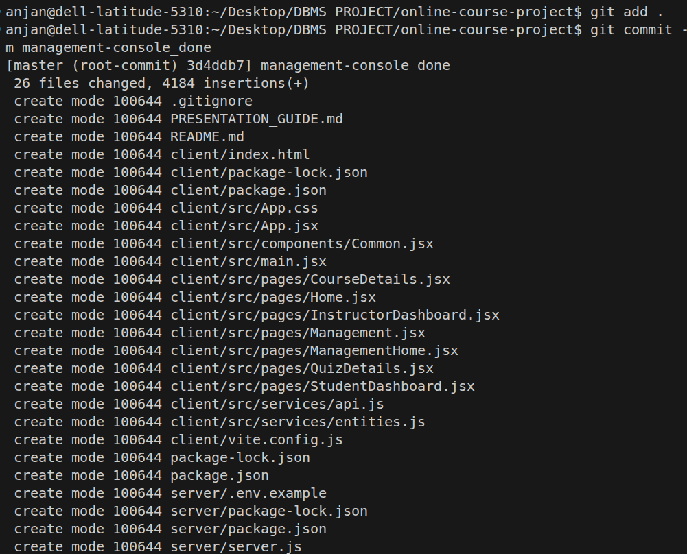
**Branching and push**

**revert**

**Open Source Contribution**
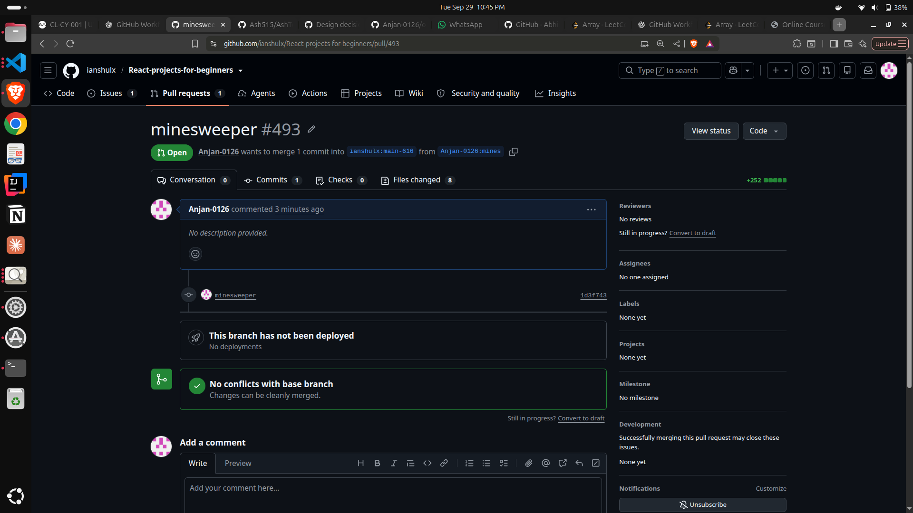
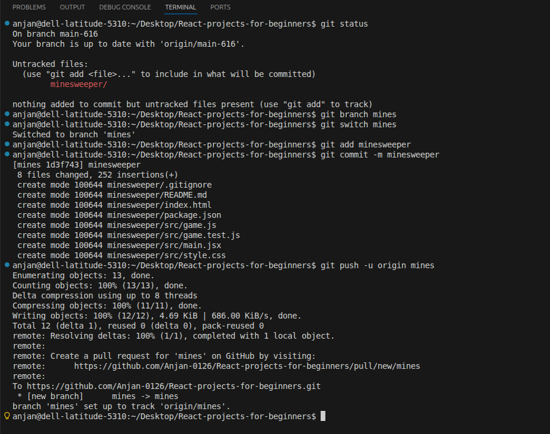
### Outcome
Successfully understood the Git/GitHub development workflow and
performed common version-control operations used in collaborative
projects.
### Key Learnings
- Version control and distributed repositories
- Git commits and branches
- Pull requests and merging
- Merge conflict resolution
- Git rebase
- Git revert and cherry-pick
- Git configuration
- Open-source contribution workflow
## Task 2: Exploring Docker Fundamentals
### Overview
This task introduced Docker, containers, images, and the differences
between containers and virtual machines.
### Implementation
I used Docker CLI to pull images from Docker Hub and create containers.
I practiced viewing running containers, checking logs, inspecting
containers, and managing their complete lifecycle.
### Execution & Results
**Docker Image Pull**
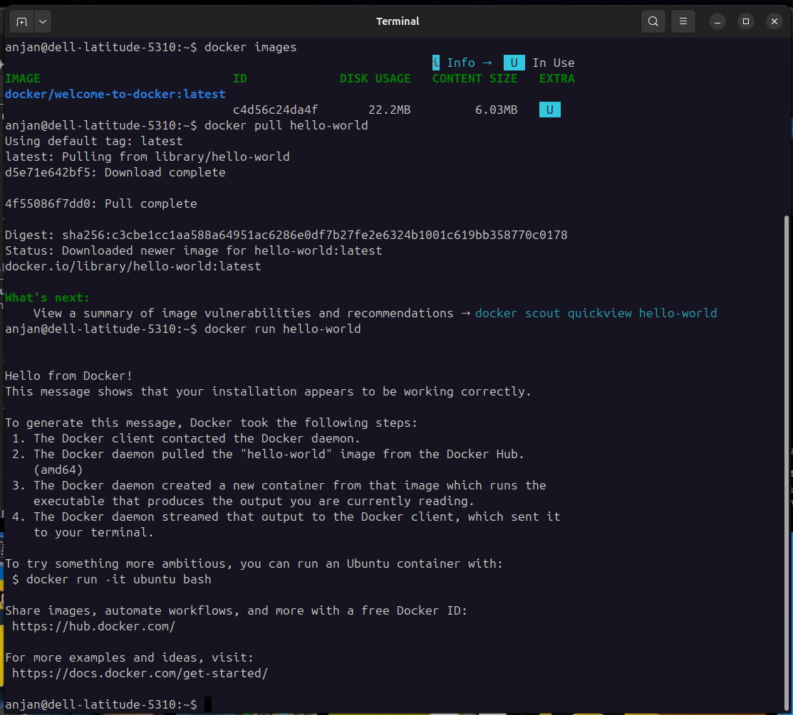
**Running images**
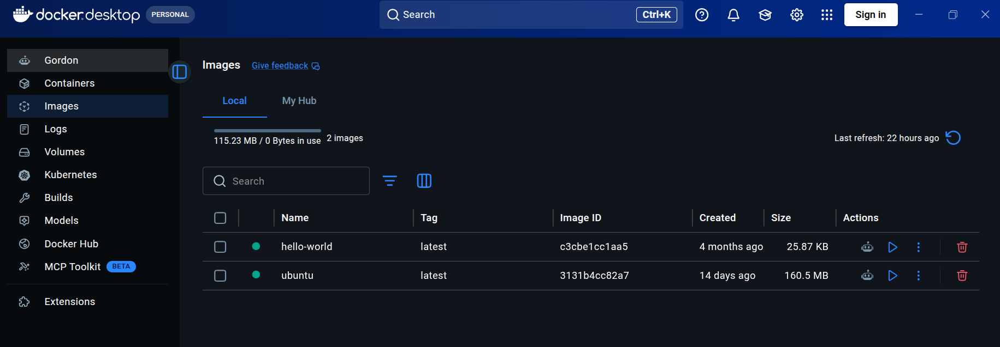
**Running Container**
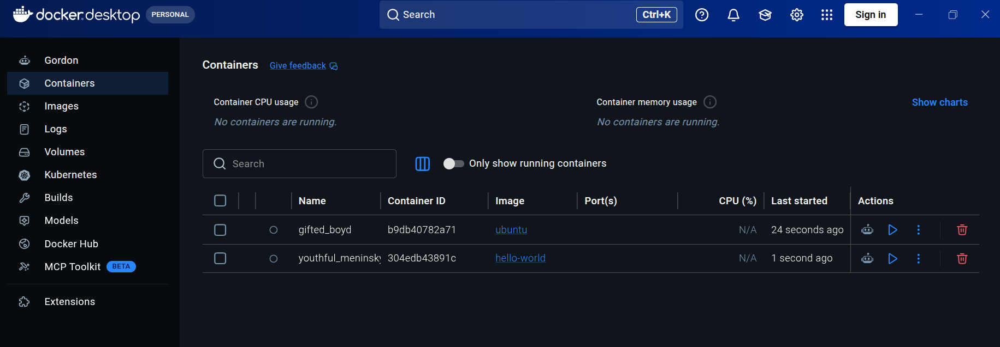
### Outcome
Successfully created and managed Docker containers and understood how
containers provide lightweight application environments.
### Key Learnings
- Containers vs Virtual Machines
- Docker images and containers
- Docker Hub
- Docker CLI
- Container logs and inspection
- Start, stop, restart and remove containers
## Task 3: Dockerize a Simple Application
### Overview
This task focused on packaging a simple application into a Docker
container using a Dockerfile.
### Implementation
I created a simple application and wrote a Dockerfile containing the
required instructions. I built a Docker image, started a container,
mapped the required ports, and accessed the application from the
browser.
### Execution & Results
**Dockerfile**
```dockerfile
FROM nginx:alpine
COPY . usr/share/nginx/html
EXPOSE 80
CMD \("nginx","-g","daemon off;"\)
```
**Docker Image Build**
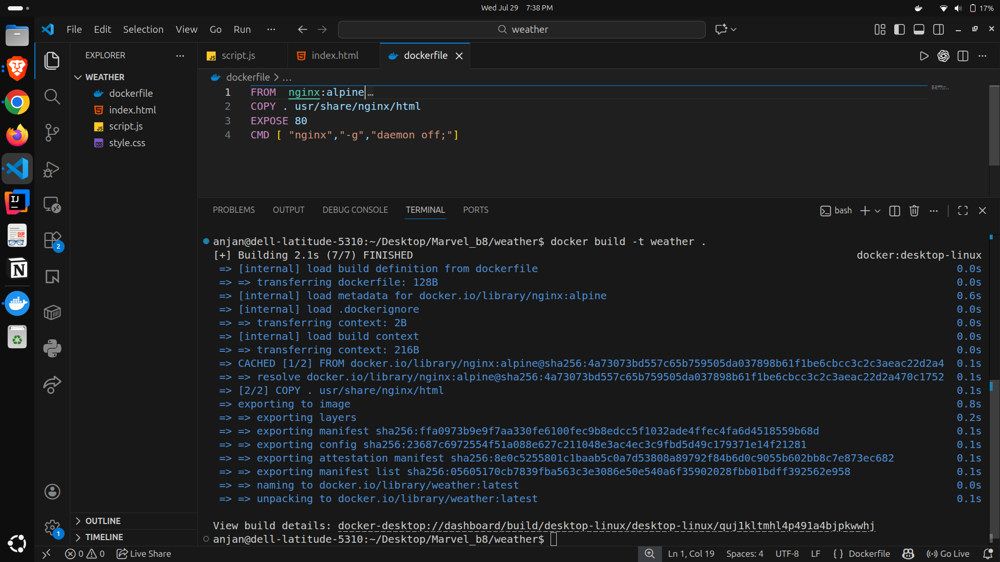
**Application Running in Container**

### Outcome
Successfully containerized an application and accessed it locally
through a Docker container.
### Key Learnings
- Dockerfile structure
- Building Docker images
- Running containers
- Port mapping
- Docker image layers
- Containerizing applications
## Task 4: Launch and Manage an AWS EC2 Instance
### Overview
This task introduced AWS EC2 and demonstrated how virtual machines can
be created and managed in the cloud.
### Implementation
I launched an EC2 instance and configured its security group for SSH and
HTTP traffic. I connected to the instance using SSH with a `.pem` key
and installed the Nginx web server. I then accessed Nginx using the EC2
public IP.
### Execution & Results
**EC2 Instance Running**
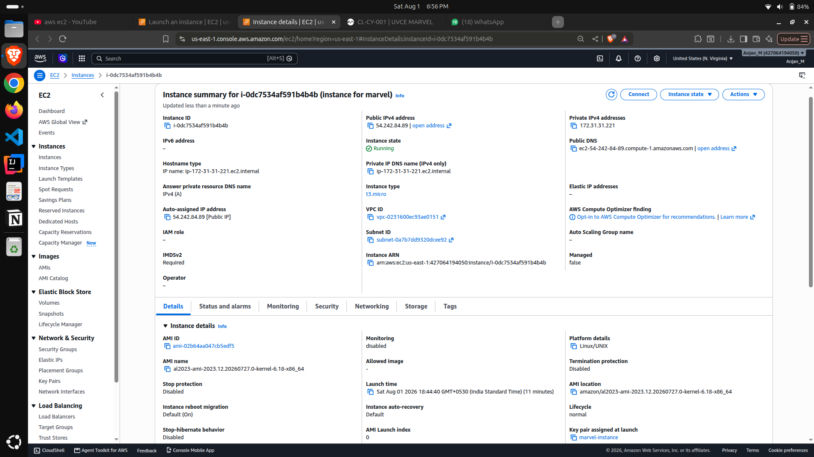
**Nginx running**
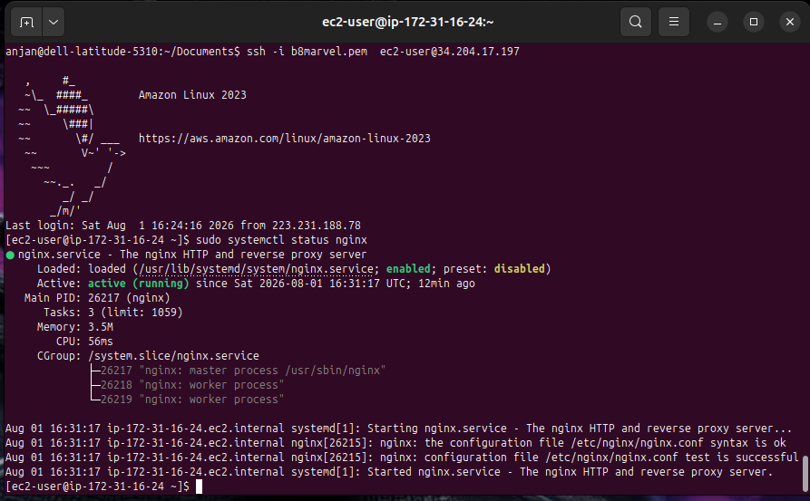
**Nginx through Public IP**
### Outcome
Successfully launched and remotely managed an AWS EC2 virtual machine
and hosted a web server on it.
### Key Learnings
- AWS EC2
- Cloud virtual machines
- EC2 instance types
- Security groups
- SSH
- Public IP addresses
- Nginx web server
- CPU and memory allocation
## Task 5: Kubernetes Basics and Writing Pod Specs
### Overview
This task introduced Kubernetes architecture and basic resources such as
clusters, nodes, pods, and the control plane.
### Implementation
I created a local Kubernetes cluster using Minikube. I wrote a YAML
manifest to create an Nginx Pod and deployed it using `kubectl`. I
also inspected the Pod status, description, and logs.
### Execution & Results
**Minikube**
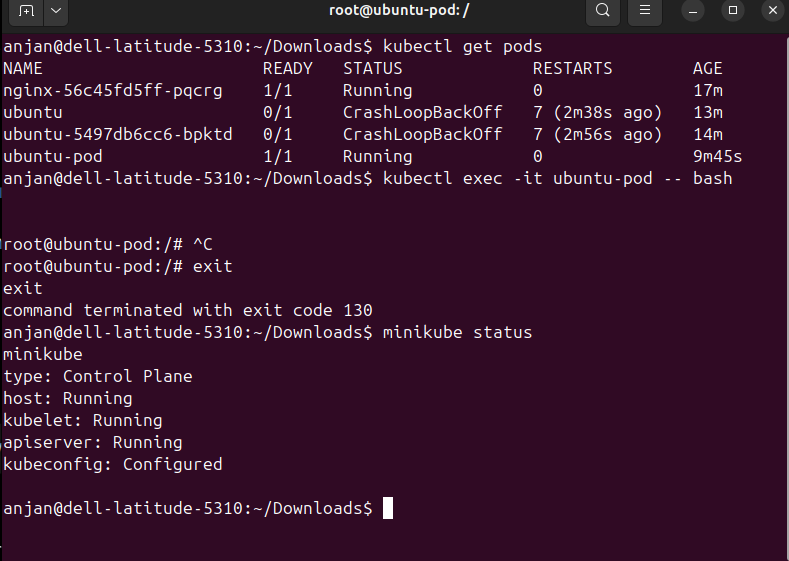
**Pod Status and Details**

### Outcome
Successfully created and managed a Kubernetes Pod using YAML manifests
and `kubectl`.
### Key Learnings
- Kubernetes clusters
- Nodes
- Pods
- Control Plane
- YAML manifests
- Minikube
- kubectl
- Pod status and logs
## Task 6: Manage AWS S3 and IAM with CLI
### Overview
This task introduced AWS Identity and Access Management (IAM), S3 cloud
storage, and AWS CLI.
### Implementation
I created an IAM user with the required permissions and configured AWS
CLI. Using CLI commands, I created an S3 bucket and performed file
upload, listing, download, and deletion operations.
### Execution & Results
**IAM User and Permissions**
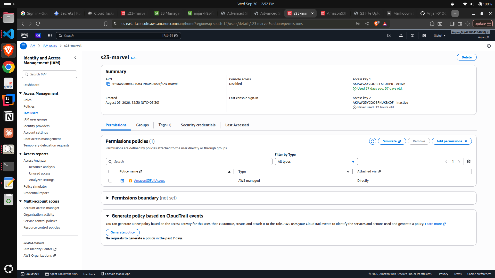
**S3 Bucket Creation**
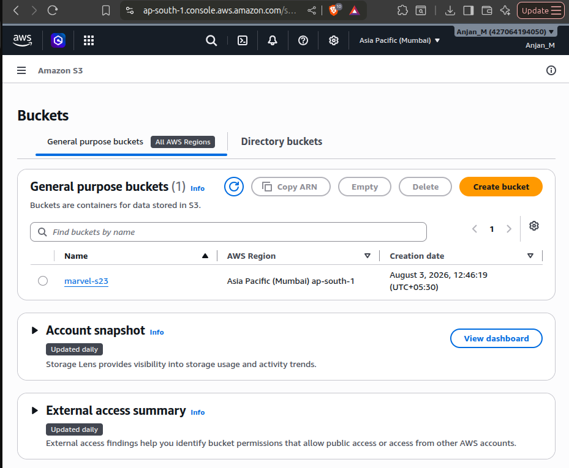
### Outcome
Successfully managed AWS S3 resources through the command line using
IAM-based authentication and permissions.
### Key Learnings
- IAM users
- IAM roles and policies
- Least-privilege principle
- AWS CLI
- S3 buckets
- S3 objects
- Uploading and downloading files
## Task 7: Deploy a Containerized Application on Kubernetes
### Overview
This task focused on deploying and managing a containerized application
using Kubernetes Deployments and Services.
### Implementation
I created a Deployment YAML for my Dockerized application and deployed
multiple replicas. I used ClusterIP for internal access and NodePort for
external access. I also practiced scaling the deployment and observing
application updates.
### Execution & Results
**Kubernetes Deployment**
**Application Running through NodePort**

### Outcome
Successfully deployed, exposed, and scaled a containerized application
using Kubernetes.
### Key Learnings
- Kubernetes Deployments
- Replica management
- ClusterIP
- NodePort
- Kubernetes Services
- Application scaling
- Rolling updates
## Task 8: Use Kubernetes Secrets and Environment Variables
### Overview
This task focused on securely managing application configuration and
sensitive information inside Kubernetes.
### Implementation
I created a ConfigMap for normal application configuration and a
Kubernetes Secret for AWS credentials. I updated the Deployment to
inject these values into the container through environment variables.
### Outcome
Successfully separated application configuration and sensitive
credentials from the application source code.
### Key Learnings
- Kubernetes ConfigMaps
- Kubernetes Secrets
- Environment variables
- Secret management
- Secure credential handling
- Difference between Secrets and ConfigMaps
## Task 9: Deploy an App to Push Files from Kubernetes to S3
### Overview
This task combined the concepts learned throughout the Cloud Computing
module into one complete application.
The goal was to deploy an application on Kubernetes that could upload
files directly to an AWS S3 bucket.
### Implementation
I developed a file-upload application and containerized it using Docker.
The Docker image was deployed to Minikube using Kubernetes.
AWS credentials were stored using Kubernetes Secrets and injected into
the application as environment variables. The application used these
credentials to communicate with AWS S3 and upload files.
The complete workflow was:
**User → Application → Docker → Kubernetes → Kubernetes Secrets →
AWS S3**
### Execution & Results
**Successful Upload**
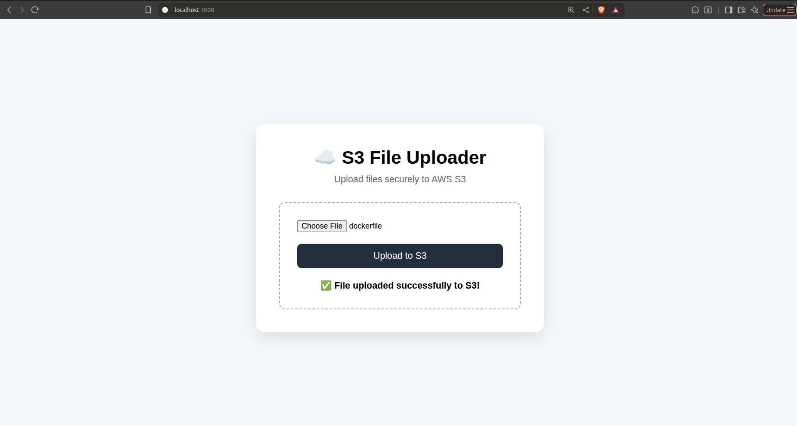
**Uploaded File in AWS S3**

### Outcome
Successfully developed and deployed a complete application that uploads
files from a Kubernetes-hosted application to AWS S3.
This task successfully integrated Docker, Kubernetes, IAM, S3,
ConfigMaps, and Secrets into a single working pipeline.
### Key Learnings
- Building a complete cloud application
- Docker containerization
- Kubernetes deployment
- Kubernetes Services
- Kubernetes Secrets
- AWS IAM authentication
- AWS S3 integration
- Application-to-cloud communication
- Integration of multiple DevOps and cloud technologies
# CY -- Cybersecurity
The Cybersecurity Level 1 tasks were completed through TryHackMe.
The tasks covered networking, protocols, Windows, Linux, cryptography,
cybersecurity principles, and Red Teaming.
## Task 1: Fundamentals of Computer Networking -- Introduction
Learned the basic concepts of computer networking, including how
computers and other devices connect and communicate with each other.
This task helped me understand why networking is one of the most
important foundations of cybersecurity.
Key Learnings: Computer networks, network communication, devices in
a network, LAN and WAN.
## Task 2: Fundamentals of Computer Networking -- Internet
Learned how the Internet works as a large collection of interconnected
networks. Understood how devices on different networks can communicate
and how data travels through the Internet to reach its destination.
Key Learnings: Internet, private networks, public networks, routers,
Internet communication.
## Task 3: Fundamentals of Computer Networking -- IP Address
Learned how IP addresses are used to uniquely identify devices on a
network. Understood the basic purpose of IPv4 addresses and how IP
addresses help route data between source and destination devices.
Key Learnings: IP addresses, IPv4, network addressing, source and
destination addresses.
## Task 4: Fundamentals of Computer Networking -- Ports
Learned how ports allow different applications and services to
communicate through the same IP address. Explored commonly used ports
and understood the combination of an IP address and port for identifying
network services.
Key Learnings: Ports, port numbers, network services, TCP/UDP ports.
## Task 5: Fundamentals of Computer Networking -- Packets & Frames
Learned how data is divided into smaller units before being transmitted
across a network. Understood the basic difference between packets and
frames and their role during network communication.
Key Learnings: Packets, frames, data transmission, encapsulation,
network communication.
## Task 6: Fundamentals of Computer Networking -- Networking
Devices
Learned about the devices responsible for connecting and managing
computer networks. Understood the basic roles of routers, switches,
access points, and firewalls.
Key Learnings: Router, switch, firewall, access point, network
infrastructure.
## Task 7: Protocols -- DNS
Learned how the Domain Name System converts human-readable domain names
into IP addresses. This allows users to access websites using names
instead of remembering IP addresses.
Key Learnings: DNS, domain names, IP resolution, DNS queries.
## Task 8: Protocols -- DHCP
Learned how DHCP automatically provides network configuration to devices
when they join a network. Understood the basic DHCP process used to
assign IP addresses.
Key Learnings: DHCP, automatic IP assignment, network configuration,
DORA process.
## Task 9: Protocols -- ICMP
Learned how ICMP is used for network diagnostics and communication of
network-related information. Explored how commands such as ping use
ICMP to test whether another device is reachable.
Key Learnings: ICMP, ping, connectivity testing, network
diagnostics.
## Task 10: Protocols -- HTTP(S)
Learned how HTTP enables communication between web browsers and web
servers. Also understood how HTTPS improves security by protecting web
communication using encryption.
Key Learnings: HTTP, HTTPS, web requests, responses, encrypted
communication.
## Task 11: Protocols -- Other Important Models
Learned about networking models that divide network communication into
different layers. This helped me understand how different protocols work
together when data moves between systems.
Key Learnings: Network models, layers, protocols, layered
communication.
## Task 12: Windows -- Introduction
Learned the fundamentals of the Windows operating system and explored
important Windows components from a cybersecurity perspective.
Key Learnings: Windows OS, system components, users, files, Windows
environment.
## Task 13: Windows -- PowerShell
Learned how PowerShell can be used to interact with Windows through
commands. Practiced basic commands for obtaining system information and
managing the Windows environment.
Key Learnings: PowerShell, cmdlets, command line, Windows
administration.
## Task 14: Windows -- PowerShell vs CMD
Compared PowerShell with the traditional Windows Command Prompt. Learned
that PowerShell provides more powerful scripting and system-management
capabilities while CMD provides traditional command-line functionality.
Key Learnings: PowerShell, CMD, scripting, Windows command-line
tools.
## Task 15: Windows -- System32
Learned about the Windows System32 directory and why it is an
important part of the operating system. It contains many essential
system executables, libraries, and utilities required by Windows.
Key Learnings: System32, Windows system files, executables, system
utilities.
## Task 16: Windows -- User Accounts & UAC
Learned how Windows manages different user accounts and privileges.
Understood how User Account Control (UAC) helps prevent applications
from performing administrative actions without proper authorization.
Key Learnings: User accounts, administrator privileges, permissions,
UAC, access control.
## Task 17: Windows -- Security
Learned about important Windows security mechanisms used to protect
users, files, and the operating system from security threats.
Key Learnings: Windows security, access control, system protection,
security mechanisms.
## Task 18: Linux -- Introduction
Learned the fundamentals of Linux and why Linux is widely used in
servers, cloud computing, and cybersecurity. Practiced interacting with
Linux through the terminal.
Key Learnings: Linux, terminal, commands, system navigation, Linux
environment.
## Task 19: Linux -- File Systems
Learned how Linux organizes files and directories. Explored the Linux
filesystem hierarchy and practiced navigating and managing files through
terminal commands.
Key Learnings: Linux filesystem, directories, paths, files,
filesystem navigation.
## Task 20: Cryptography -- Part 1
Learned the fundamentals of cryptography and how information can be
transformed to protect it from unauthorized access. Understood the basic
ideas behind plaintext, ciphertext, encryption, and decryption.
Key Learnings: Cryptography, plaintext, ciphertext, encryption,
decryption.
## Task 21: Cryptography -- Part 2
Continued learning cryptography and explored additional techniques used
to secure information and communication.
Key Learnings: Encryption techniques, cryptographic algorithms,
secure communication, data protection.
## Task 22: Cipher Breaker Challenge
Applied the concepts learned in the cryptography tasks to a practical
cipher challenge. Analyzed the provided encrypted information and used
cryptographic concepts to determine the original message.
Key Learnings: Cipher analysis, decryption, pattern recognition,
problem solving.
## Task 23: Principles of Cybersecurity -- CIA
Learned about the CIA Triad, one of the fundamental models used in
cybersecurity.
- Confidentiality -- Information should only be accessible to
  authorized users.
- Integrity -- Information should not be modified without
  authorization.
- Availability -- Systems and information should be accessible
  when required.
Key Learnings: Confidentiality, Integrity, Availability, information
security.
## Task 24: Principles of Cybersecurity -- CIA Explanation
Explored the CIA Triad in greater detail using practical examples.
Learned how different security controls can protect confidentiality,
maintain data integrity, and ensure system availability.
Key Learnings: CIA Triad applications, security controls,
information protection.
## Task 25: Red Teaming
Learned the fundamentals of Red Teaming and offensive security.
Understood how authorized security professionals approach systems from
an attacker's perspective to discover weaknesses before malicious
attackers can exploit them.
Key Learnings: Red Teaming, offensive security, vulnerabilities,
penetration testing, attacker mindset.
## Task 26: Red Teaming Continuation
Continued learning Red Teaming concepts and understood how offensive
security assessments help organizations discover and fix weaknesses in
their systems. Also understood the importance of authorization and
clearly defined scope during security testing.
Key Learnings: Red Team methodology, vulnerability identification,
security assessment, authorization, scope, ethical security testing.
# Overall Outcome
MARVEL Level 1 provided practical exposure to two important technical
domains: **Cloud Computing and Cybersecurity**.
In Cloud Computing, I learned how applications can move through the
complete workflow:
**GitHub → Docker → Kubernetes → AWS**
I gained hands-on experience with Git, Docker, AWS EC2, IAM, S3,
Kubernetes, Minikube, ConfigMaps, and Secrets.
In Cybersecurity, I developed a stronger foundation in networking,
protocols, Windows, Linux, and security principles through TryHackMe
exercises.
# Overall Key Learnings
Through Level 1, I gained practical experience in:
- Version control and collaborative development
- Containerization
- Cloud virtual machines
- Cloud storage
- Identity and access management
- Container orchestration
- Application deployment
- Configuration and secret management
- Networking fundamentals
- Operating system fundamentals
- Cybersecurity fundamentals
- Offensive and defensive security concepts
These tasks provided a strong foundation for progressing into more
advanced **Cloud, DevOps, and Cybersecurity** concepts.